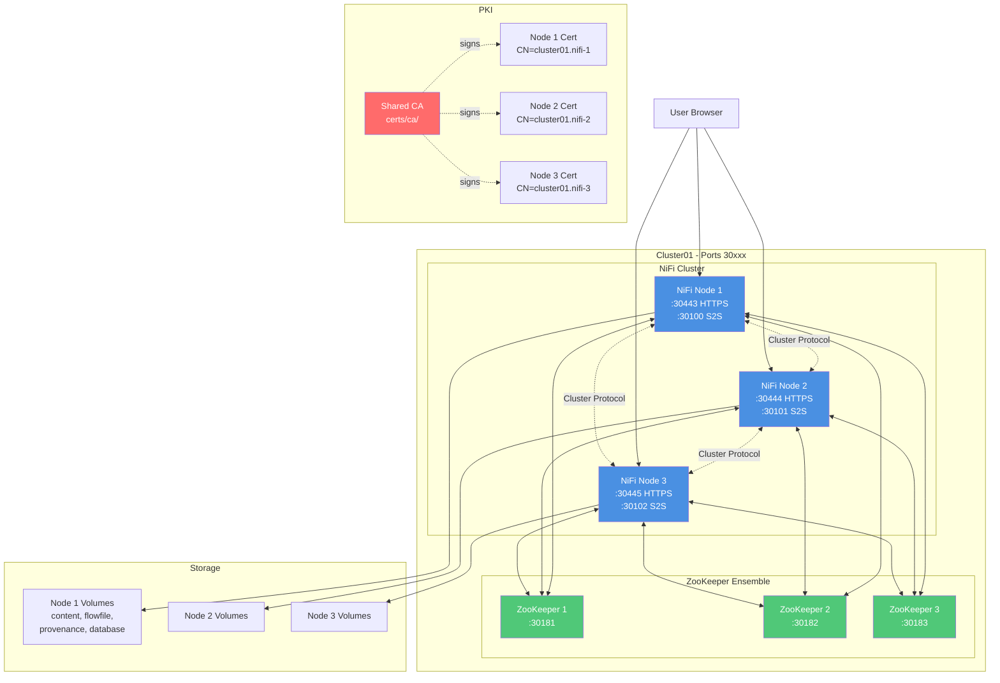
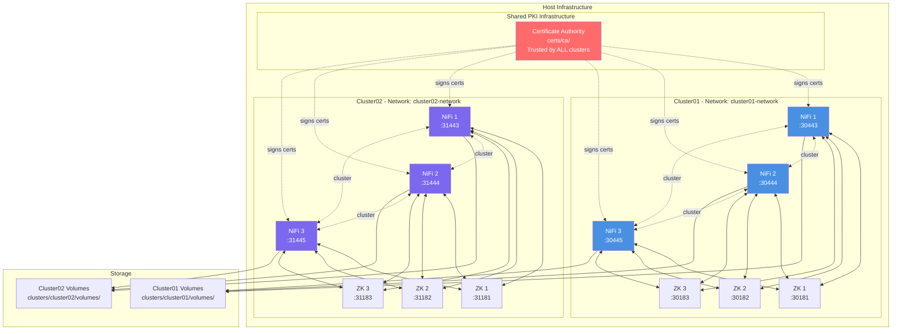
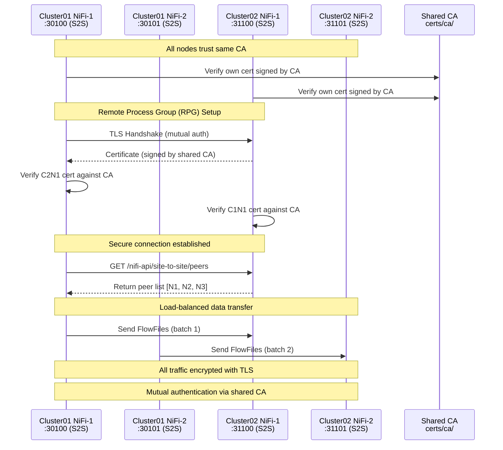

# Multi-Cluster Apache NiFi Platform

Production-ready multi-cluster Apache NiFi deployment with complete isolation, automated configuration, shared PKI infrastructure, and unified CLI management.

## Quick Start

```bash
# Create first cluster (3 nodes, ports 30xxx)
./cluster create cluster01

# Validate configuration
./cluster validate cluster01

# Start cluster
./cluster start cluster01

# Wait for cluster to be ready
./cluster wait cluster01

# Test cluster health
./cluster test cluster01

# Access NiFi UI
open https://localhost:30443/nifi
```

**Default Credentials**: `admin` / `changeme123456`

## Features

- **Unified CLI Management**: Single `cluster` command for all operations (create, start, stop, test, validate, etc.)
- **Multi-Cluster Support**: Run multiple independent clusters on one host with automatic port allocation
- **Complete Isolation**: Separate networks, volumes, configurations, and docker-compose files per cluster
- **Shared PKI Infrastructure**: Single Certificate Authority for all clusters enables inter-cluster communication
- **Automated Setup**: One-command cluster creation with full validation and testing
- **Auto-Detection**: Scripts automatically detect cluster parameters (node count, ports, certificates)
- **Production Ready**: TLS/SSL enabled, configurable JVM settings, comprehensive health checks
- **Site-to-Site Ready**: Pre-configured for secure inter-cluster data transfer

## Architecture

> **📊 Detailed Architecture Diagrams**: For more comprehensive and interactive architecture visualizations, see the professional draw.io diagrams in [`docs/diagrams/`](docs/diagrams/):
> - [Single Cluster Architecture](docs/diagrams/01-single-cluster-architecture.drawio)
> - [Multi-Cluster Architecture](docs/diagrams/02-multi-cluster-architecture.drawio)
> - [Site-to-Site Communication Flow](docs/diagrams/03-site-to-site-communication.drawio)
>
> These diagrams provide detailed views of network topology, port allocations, PKI infrastructure, and inter-cluster communication flows.

**Video Tutorial**: Learn how to build and connect multiple NiFi clusters with Site-to-Site communication:

[](https://youtu.be/NM4LgNRZSmM)

**[Watch: Apache NiFi 2.x — Build and Connect Clusters with Site-to-Site (S2S) Communication](https://youtu.be/NM4LgNRZSmM)**

This comprehensive tutorial covers the complete architecture of this project, including:
- Building multiple independent NiFi clusters
- Shared PKI infrastructure and certificate management
- Site-to-Site protocol configuration
- Secure inter-cluster communication
- Load balancing and high availability

### Single Cluster Architecture



### Multi-Cluster Architecture



### Inter-Cluster Communication (Site-to-Site)



**Key Points**:

- **Shared CA**: All clusters trust the same Certificate Authority (certs/ca/)
- **Mutual TLS**: Both sides authenticate using certificates signed by shared CA
- **Site-to-Site Protocol**: NiFi's secure data transfer protocol (ports 30100-30102, 31100-31102, etc.)
- **Load Balancing**: Automatically distributes across available peers
- **No Extra Config**: Works out-of-the-box because all clusters share the same PKI

## Directory Structure

```
nifi-cluster/
├── cluster                          # Unified CLI (main entry point)
├── lib/                             # Library scripts
│   ├── cluster-utils.sh             # Shared utility functions
│   ├── create-cluster.sh            # Cluster creation implementation
│   ├── delete-cluster.sh            # Cluster deletion implementation
│   ├── check-cluster.sh             # Health checking
│   └── generate-docker-compose.sh   # Docker Compose generator
├── validate                         # Configuration validation (auto-detects)
├── test                             # Comprehensive testing (auto-detects)
│
├── certs/                           # Shared PKI for ALL clusters
│   ├── ca/                          # Certificate Authority (SHARED)
│   │   ├── ca-key.pem               # CA private key (CRITICAL)
│   │   ├── ca-cert.pem              # CA certificate (TRUSTED BY ALL)
│   │   └── truststore.p12           # CA truststore
│   ├── generate-certs.sh            # Certificate generation
│   └── README.md                    # PKI documentation
│
├── clusters/                        # All cluster workspaces
│   ├── cluster01/                   # Cluster01 isolated workspace
│   │   ├── certs/                   # Node certificates (signed by shared CA)
│   │   │   ├── ca/                  # Copy of shared CA
│   │   │   ├── cluster01.nifi-1/    # Node 1 cert (CN=cluster01.nifi-1.DOMAIN)
│   │   │   ├── cluster01.nifi-2/    # Node 2 cert
│   │   │   ├── cluster01.nifi-3/    # Node 3 cert
│   │   │   └── cluster01.zookeeper-{1,2,3}/
│   │   ├── conf/                    # Node configurations
│   │   │   ├── cluster01.nifi-1/    # Node 1 config
│   │   │   │   ├── nifi.properties
│   │   │   │   ├── keystore.p12
│   │   │   │   ├── truststore.p12
│   │   │   │   ├── authorizers.xml
│   │   │   │   ├── bootstrap.conf
│   │   │   │   └── ... (all NiFi config files)
│   │   │   ├── cluster01.nifi-2/
│   │   │   └── cluster01.nifi-3/
│   │   └── volumes/                 # Runtime data (gitignored)
│   │       ├── cluster01.nifi-1/
│   │       │   ├── content_repository/
│   │       │   ├── flowfile_repository/
│   │       │   ├── provenance_repository/
│   │       │   ├── database_repository/
│   │       │   ├── state/
│   │       │   └── logs/
│   │       ├── cluster01.nifi-2/
│   │       ├── cluster01.nifi-3/
│   │       └── cluster01.zookeeper-{1,2,3}/
│   │
│   └── cluster02/                   # Cluster02 (same structure)
│       └── ... (mirrors cluster01 structure)
│
├── conf/                            # Configuration templates
│   └── templates/                   # Base templates for new clusters
│       ├── authorizers.xml
│       ├── bootstrap.conf
│       ├── logback.xml
│       ├── login-identity-providers.xml
│       └── zookeeper.properties
│
├── docker-compose-cluster01.yml     # Cluster01 compose file (auto-generated)
├── docker-compose-cluster02.yml     # Cluster02 compose file (auto-generated)
│
├── backlog/                         # Project management
│   ├── docs/                        # Design documents
│   └── tasks/                       # Task tracking
│
├── CLAUDE.md                        # Project instructions for AI
└── README.md                        # This file
```

**Key Principles**:

- All cluster-specific data is in `clusters/<CLUSTER_NAME>/` (gitignored)
- Shared CA enables inter-cluster communication
- Each cluster has its own Docker network and docker-compose file
- Scripts auto-detect cluster parameters from workspace structure

## Port Allocation

### Port Formula

```
BASE_PORT = 29000 + (CLUSTER_NUM × 1000)
```

### Port Mapping

| Service               | Port Offset | Example (cluster01) | Example (cluster02) |
| --------------------- | ----------- | ------------------- | ------------------- |
| NiFi HTTPS (Node 1)   | +443        | 30443               | 31443               |
| NiFi HTTPS (Node 2)   | +444        | 30444               | 31444               |
| NiFi HTTPS (Node 3)   | +445        | 30445               | 31445               |
| Site-to-Site (Node 1) | +100        | 30100               | 31100               |
| Site-to-Site (Node 2) | +101        | 30101               | 31101               |
| Site-to-Site (Node 3) | +102        | 30102               | 31102               |
| ZooKeeper (Node 1)    | +181        | 30181               | 31181               |
| ZooKeeper (Node 2)    | +182        | 30182               | 31182               |
| ZooKeeper (Node 3)    | +183        | 30183               | 31183               |

### Cluster Examples

| Cluster Name | Cluster # | HTTPS Ports | S2S Ports   | ZK Ports    |
| ------------ | --------- | ----------- | ----------- | ----------- |
| cluster01    | 1         | 30443-30445 | 30100-30102 | 30181-30183 |
| cluster02    | 2         | 31443-31445 | 31100-31102 | 31181-31183 |
| cluster03    | 3         | 32443-32445 | 32100-32102 | 32181-32183 |
| production05 | 5         | 34443-34445 | 34100-34102 | 34181-34183 |

## Cluster Management CLI

The `cluster` script provides a unified interface for all cluster operations.

### Naming Convention

**IMPORTANT**: Cluster names MUST follow the pattern `[text][two-digits]`

- **Valid**: `cluster01`, `cluster05`, `production02`, `test10`
- **Invalid**: `cluster1` (one digit), `cluster11` (>10), `cluster_01` (underscore)
- The two digits (01-10) determine the cluster number for port allocation

### Common Commands

```bash
# Cluster Lifecycle
./cluster create <name> [nodes]      # Create cluster (default: 3 nodes)
./cluster start <name>               # Start cluster
./cluster stop <name>                # Stop cluster
./cluster restart <name> [node]      # Restart cluster or node
./cluster delete <name> [--force]    # Delete cluster

# Status & Monitoring
./cluster status <name>              # Show detailed status
./cluster health <name>              # Quick health check
./cluster wait <name>                # Wait for cluster ready
./cluster info <name>                # Show cluster details
./cluster ports <name>               # Show port mappings
./cluster url <name> [node]          # Get NiFi UI URL

# Testing & Validation
./cluster validate <name>            # Validate configuration (31 checks)
./cluster test <name>                # Run comprehensive tests (32 tests)

# Logs & Debugging
./cluster logs <name> [service]      # View logs
./cluster follow <name> [service]    # Follow logs in real-time
./cluster shell <name> <node>        # Interactive shell
./cluster exec <name> <node> <cmd>   # Execute command

# Utilities
./cluster list                       # List all clusters
./cluster help [command]             # Show help
```

### Auto-Detection

Scripts automatically detect cluster parameters:

- Node count from workspace structure
- Base port from cluster number
- Certificate paths from cluster name
- Docker Compose file location

**No need to specify these parameters repeatedly!**

## Usage Examples

### Create and Start Single Cluster

```bash
# Create cluster01 with 3 nodes (default)
./cluster create cluster01

# Start cluster
./cluster start cluster01

# Validate configuration (31 checks)
./cluster validate cluster01

# Wait for cluster to be ready (auto-detects timeout)
./cluster wait cluster01

# Test cluster health (32 comprehensive tests)
./cluster test cluster01

# Get cluster info
./cluster info cluster01

# Access NiFi UI
open $(./cluster url cluster01)
```

### Manage Multiple Clusters Simultaneously

```bash
# Create two clusters
./cluster create cluster01
./cluster create cluster02

# Start both
./cluster start cluster01
./cluster start cluster02

# Wait for both to be ready
./cluster wait cluster01 &
./cluster wait cluster02 &
wait

# Test both
./cluster test cluster01
./cluster test cluster02

# List all clusters
./cluster list

# Check status
./cluster status cluster01
./cluster status cluster02

# View logs
./cluster follow cluster01 nifi-1    # Terminal 1
./cluster follow cluster02 nifi-1    # Terminal 2

# Stop both
./cluster stop cluster01
./cluster stop cluster02
```

### Custom Node Counts

```bash
# Single-node cluster (development)
./cluster create cluster03 1

# Five-node cluster (production)
./cluster create cluster04 5

# Seven-node cluster
./cluster create cluster05 7
```

### Inter-Cluster Communication Setup

```bash
# 1. Ensure both clusters are running and healthy
./cluster health cluster01
./cluster health cluster02

# 2. Get cluster02 S2S endpoint
CLUSTER02_S2S="https://cluster02.nifi-1.ymbihq.local:31100"

# 3. In cluster01 NiFi UI:
#    - Add Remote Process Group (RPG)
#    - Set URL to: https://cluster02.nifi-1.ymbihq.local:31443/nifi
#    - Enable input/output ports on cluster02
#    - Create connection from cluster01 processor to RPG

# 4. Verify S2S connectivity
curl -k -s \
  --cert clusters/cluster01/certs/cluster01.nifi-1/server-cert.pem \
  --key clusters/cluster01/certs/cluster01.nifi-1/server-key.pem \
  -H "x-nifi-site-to-site-protocol-version: 1" \
  https://cluster02.nifi-1.ymbihq.local:31443/nifi-api/site-to-site/peers | jq .

# 5. Data flows automatically between clusters via S2S protocol
```

**Why it works**: Both clusters trust the same CA (certs/ca/), enabling mutual TLS authentication without additional certificate configuration.

### Debugging and Troubleshooting

```bash
# Check cluster status
./cluster status cluster01

# View recent logs
./cluster logs cluster01 nifi-1 --tail 100

# Follow logs in real-time
./cluster follow cluster01

# Execute command in container
./cluster exec cluster01 1 cat /opt/nifi/nifi-current/logs/nifi-app.log

# Interactive shell
./cluster shell cluster01 1

# Check ZooKeeper
./cluster exec cluster01 zookeeper-1 zkCli.sh get /nifi/components

# Verify certificates
./cluster exec cluster01 1 openssl x509 -in conf/keystore.p12 -text -noout

# Restart specific node
./cluster restart cluster01 2
```

### Complete Workflow Example

```bash
# 1. Create cluster
./cluster create cluster01 3

# 2. Validate before starting
if ./cluster validate cluster01; then
    echo "Validation passed!"
else
    echo "Validation failed. Check configuration."
    exit 1
fi

# 3. Start cluster
./cluster start cluster01

# 4. Wait up to 5 minutes for readiness
if ./cluster wait cluster01 --timeout 300; then
    echo "Cluster ready!"
else
    echo "Cluster failed to start. Check logs."
    ./cluster logs cluster01
    exit 1
fi

# 5. Run comprehensive tests
if ./cluster test cluster01; then
    echo "All tests passed!"
else
    echo "Tests failed. Check cluster health."
    ./cluster status cluster01
    exit 1
fi

# 6. Get access URL
URL=$(./cluster url cluster01)
echo "Access NiFi at: $URL"
echo "Credentials: admin / changeme123456"

# 7. Open in browser
open "$URL"
```

## Validation and Testing

### Configuration Validation (31 Checks)

The `validate` script performs comprehensive pre-deployment validation:

```bash
./cluster validate cluster01
```

**Validation Categories**:

1. **Directory Structure** (6 checks)

   - Volumes directories exist
   - Certificates directories exist
   - Configuration directories exist
2. **Certificate Chain** (9 checks)

   - CA certificate valid
   - Node keystores exist and valid
   - Node truststores exist and valid
   - Certificate chain integrity
3. **Configuration Files** (7 checks)

   - nifi.properties exists for all nodes
   - authorizers.xml, bootstrap.conf, etc.
   - Required properties set correctly
4. **Node Addresses** (3 checks)

   - Cluster node addresses correct
   - Site-to-Site hosts configured
   - ZooKeeper connect string valid
5. **Docker Compose** (4 checks)

   - File exists and valid YAML
   - Service count matches node count
   - Port mappings correct
   - No port conflicts
6. **Port Availability** (2 checks)

   - No duplicate ports
   - Ports not in use

### Comprehensive Testing (32 Tests)

The `test` script runs comprehensive runtime tests:

```bash
./cluster test cluster01
```

**Test Categories**:

1. **Prerequisites** (4 tests)

   - curl, jq, docker installed
   - CA certificate accessible
2. **Container Status** (6 tests)

   - All containers running
   - NiFi nodes healthy
   - ZooKeeper nodes healthy
3. **Web UI Access** (3 tests)

   - HTTPS endpoints responding
   - SSL/TLS handshake successful
   - Login page accessible
4. **Authentication** (3 tests)

   - Single-user credentials work
   - JWT token generation
   - Authenticated API access
5. **Backend API** (3 tests)

   - Cluster summary accessible
   - All nodes connected
   - System diagnostics available
6. **Cluster Status** (2 tests)

   - Cluster coordinator elected
   - All nodes reporting to coordinator
7. **ZooKeeper Health** (3 tests)

   - All ZK nodes responding
   - Ensemble healthy
   - NiFi registered in ZooKeeper
8. **SSL/TLS Validation** (3 tests)

   - Certificate chain valid
   - Server certificates trusted
   - Mutual TLS working
9. **Flow Replication** (5 tests)

   - Create processor on node 1
   - Verify replication to node 2
   - Verify replication to node 3
   - Flow consistency across cluster
   - Cleanup test processors

## Environment Variables

Customize cluster behavior via `.env` file (created automatically):

```bash
# NiFi Configuration
NIFI_VERSION=latest                       # NiFi Docker image version
NIFI_SINGLE_USER_USERNAME=admin           # Default username
NIFI_SINGLE_USER_PASSWORD=changeme123456  # Default password (CHANGE THIS!)
NIFI_JVM_HEAP_INIT=2g                     # Initial JVM heap
NIFI_JVM_HEAP_MAX=2g                      # Maximum JVM heap

# ZooKeeper Configuration
ZOOKEEPER_VERSION=3.9                     # ZooKeeper Docker image version

# Network Configuration
DOMAIN=                                   # Optional: Custom domain (e.g., ymbihq.local)

# Site-to-Site Configuration (auto-configured)
# Ports calculated automatically based on cluster number
```

**To customize**:

```bash
# Edit before starting cluster
vim .env

# Or regenerate configuration
./cluster reconfig cluster01 --config
./cluster restart cluster01
```

## Inter-Cluster Communication

### Overview

All clusters share the same Certificate Authority (CA), enabling secure Site-to-Site (S2S) communication without additional certificate configuration.

### Site-to-Site Setup

1. **Verify Both Clusters Running**

   ```bash
   ./cluster health cluster01
   ./cluster health cluster02
   ```
2. **In Source Cluster (cluster01) NiFi UI**:

   - Add **Remote Process Group** (RPG)
   - Set URL: `https://cluster02.nifi-1.ymbihq.local:31443/nifi`
   - The RPG will automatically discover all cluster02 nodes via S2S protocol
3. **In Target Cluster (cluster02) NiFi UI**:

   - Create **Input Port** (for receiving data)
   - Or **Output Port** (for sending data)
   - Give it a name (e.g., "Data from Cluster01")
4. **Connect Source to RPG**:

   - In cluster01, create connection from processor to RPG
   - Select the target port (will appear in RPG)
   - Data now flows securely between clusters

### S2S Verification

```bash
# Test S2S peer discovery from cluster01 to cluster02
curl -k -s \
  --cert clusters/cluster01/certs/cluster01.nifi-1/server-cert.pem \
  --key clusters/cluster01/certs/cluster01.nifi-1/server-key.pem \
  -H "x-nifi-site-to-site-protocol-version: 1" \
  https://cluster02.nifi-1.ymbihq.local:31443/nifi-api/site-to-site/peers | jq .
```

**Expected Response**:

```json
{
  "peers": [
    {
      "hostname": "cluster02.nifi-1.ymbihq.local",
      "port": 31100,
      "secure": true,
      "flowFileCount": 0
    },
    {
      "hostname": "cluster02.nifi-2.ymbihq.local",
      "port": 31101,
      "secure": true,
      "flowFileCount": 0
    },
    {
      "hostname": "cluster02.nifi-3.ymbihq.local",
      "port": 31102,
      "secure": true,
      "flowFileCount": 0
    }
  ]
}
```

### S2S Architecture

- **Protocol**: Site-to-Site (S2S) over TLS
- **Ports**: Dedicated S2S ports (30100-30102, 31100-31102, etc.)
- **Security**: Mutual TLS authentication using shared CA
- **Load Balancing**: Automatic distribution across cluster nodes
- **Compression**: Optional data compression in transit
- **Batching**: Efficient batch transfers

### Remote Process Group Tutorial

For a detailed walkthrough of Remote Process Groups and Site-to-Site communication, watch this video tutorial:

[](https://youtu.be/M3svwwwhzKU)

**[Watch: Understanding Remote Process Groups in Apache NiFi](https://youtu.be/M3svwwwhzKU)**

This tutorial covers:
- What Remote Process Groups are and how they work
- Setting up Site-to-Site connections between NiFi instances
- Configuring input and output ports
- Security considerations for S2S communication
- Load balancing across cluster nodes

### Why Shared CA Matters

Without shared CA:

- Each cluster would need to import the other cluster's CA
- Complex certificate exchange process
- Manual trust relationship setup

With shared CA:

- All clusters automatically trust each other
- No additional certificate configuration
- Secure by default

## Backup and Recovery

### Backup Cluster

```bash
# Stop cluster first
./cluster stop cluster01

# Backup entire cluster workspace
tar -czf cluster01-backup-$(date +%Y%m%d-%H%M%S).tar.gz \
    docker-compose-cluster01.yml \
    clusters/cluster01/

# Start cluster again
./cluster start cluster01
```

### Backup Shared CA (CRITICAL)

```bash
# Backup CA (affects ALL clusters)
tar -czf ca-backup-$(date +%Y%m%d-%H%M%S).tar.gz certs/ca/

# Store securely off-site
# Without this, you cannot recreate clusters with same PKI
```

### Restore Cluster

```bash
# Extract backup
tar -xzf cluster01-backup-YYYYMMDD-HHMMSS.tar.gz

# Start cluster
./cluster start cluster01

# Verify
./cluster test cluster01
```

### Backup Strategy Recommendation

```bash
#!/bin/bash
# automated-backup.sh

DATE=$(date +%Y%m%d-%H%M%S)
BACKUP_DIR="/backups/nifi-clusters"

# Backup CA (once per backup cycle)
tar -czf "$BACKUP_DIR/ca-backup-$DATE.tar.gz" certs/ca/

# Backup each cluster
for cluster in $(./cluster list --quiet); do
    echo "Backing up $cluster..."
    ./cluster stop "$cluster"

    tar -czf "$BACKUP_DIR/${cluster}-backup-$DATE.tar.gz" \
        "docker-compose-${cluster}.yml" \
        "clusters/${cluster}/"

    ./cluster start "$cluster"
done

# Rotate old backups (keep last 30 days)
find "$BACKUP_DIR" -name "*.tar.gz" -mtime +30 -delete
```

## Troubleshooting

### Cluster Won't Start

```bash
# Check container status
./cluster status cluster01

# View logs
./cluster logs cluster01 nifi-1 --tail 100
./cluster logs cluster01 zookeeper-1

# Check for port conflicts
./cluster validate cluster01

# Check Docker resources
docker system df
docker stats --no-stream
```

### Node Not Joining Cluster

```bash
# Check cluster logs for specific node
./cluster follow cluster01 nifi-2 | grep -i cluster

# Verify ZooKeeper connectivity
./cluster exec cluster01 nifi-2 nc -zv cluster01.zookeeper-1 2181

# Check cluster coordinator
./cluster exec cluster01 nifi-1 \
  cat /opt/nifi/nifi-current/logs/nifi-app.log | grep -i coordinator

# Restart problematic node
./cluster restart cluster01 2
```

### Site-to-Site Connection Issues

```bash
# Verify DNS resolution (if using custom DOMAIN)
./cluster exec cluster01 nifi-1 nslookup cluster02.nifi-1.ymbihq.local

# Test S2S port connectivity
./cluster exec cluster01 nifi-1 nc -zv cluster02.nifi-1.ymbihq.local 31100

# Verify certificate trust
./cluster exec cluster01 nifi-1 \
  openssl s_client -connect cluster02.nifi-1.ymbihq.local:31443 \
  -CAfile conf/truststore.p12 -showcerts

# Check S2S peer discovery
curl -k -s \
  --cert clusters/cluster01/certs/cluster01.nifi-1/server-cert.pem \
  --key clusters/cluster01/certs/cluster01.nifi-1/server-key.pem \
  -H "x-nifi-site-to-site-protocol-version: 1" \
  https://cluster02.nifi-1.ymbihq.local:31443/nifi-api/site-to-site/peers | jq .
```

### Certificate Issues

```bash
# Verify CA certificate
openssl x509 -in certs/ca/ca-cert.pem -text -noout

# Verify node certificate
openssl x509 -in clusters/cluster01/certs/cluster01.nifi-1/server-cert.pem -text -noout

# Check certificate chain
./cluster exec cluster01 nifi-1 \
  openssl verify -CAfile conf/truststore.p12 conf/keystore.p12

# Regenerate cluster certificates (preserves CA)
./cluster delete cluster01 --force
./cluster create cluster01 3
```

### Performance Issues

```bash
# Check resource usage
docker stats

# Check disk space
df -h
du -sh clusters/cluster01/volumes/*

# Increase JVM heap (edit .env)
vim .env
# Set: NIFI_JVM_HEAP_INIT=4g
#      NIFI_JVM_HEAP_MAX=4g

# Restart cluster
./cluster restart cluster01

# Monitor NiFi logs for GC issues
./cluster logs cluster01 nifi-1 | grep -i "garbage collection"
```

## Security Best Practices

1. **Change Default Passwords**

   ```bash
   vim .env
   # Update NIFI_SINGLE_USER_PASSWORD
   ./cluster reconfig cluster01 --config
   ./cluster restart cluster01
   ```
2. **Protect CA Private Key**

   ```bash
   chmod 600 certs/ca/ca-key.pem
   chown root:root certs/ca/ca-key.pem
   ```
3. **Use Strong Passwords**

   - Minimum 12 characters
   - Mix of uppercase, lowercase, numbers, symbols
4. **Regular Updates**

   ```bash
   # Update NIFI_VERSION in .env
   vim .env
   ./cluster stop cluster01
   docker compose -f docker-compose-cluster01.yml pull
   ./cluster start cluster01
   ```
5. **Firewall Rules**

   ```bash
   # Only allow access from specific IPs
   sudo ufw allow from 192.168.1.0/24 to any port 30443 proto tcp
   ```
6. **Production Authentication**

   - Replace single-user authentication with LDAP or OIDC
   - Configure in authorizers.xml
   - See NiFi documentation for details
7. **Regular Backups**

   - Daily automated backups
   - Test restore procedures quarterly
   - Store CA backup off-site
8. **Monitor Security Logs**

   ```bash
   ./cluster logs cluster01 nifi-1 | grep -i "authentication\|authorization"
   ```

## Advanced Features

### Network Isolation

Each cluster operates on its own Docker network:

```bash
# List cluster networks
docker network ls | grep cluster

# Inspect cluster01 network
docker network inspect cluster01-nifi-cluster_cluster01-network

# View connected containers
docker network inspect cluster01-nifi-cluster_cluster01-network \
  --format '{{range .Containers}}{{.Name}} {{end}}'
```

### Custom Domain Configuration

Set custom domain in `.env` for FQDN-based addressing:

```bash
# Edit .env
echo "DOMAIN=ymbihq.local" >> .env

# Regenerate configuration
./cluster reconfig cluster01 --config

# Restart cluster
./cluster restart cluster01

# Node addresses become:
# cluster01.nifi-1.ymbihq.local
# cluster01.nifi-2.ymbihq.local
# cluster01.nifi-3.ymbihq.local
```

### Scaling Clusters

```bash
# Create with different node counts
./cluster create cluster03 1   # Single node (dev)
./cluster create cluster04 5   # 5 nodes (production)
./cluster create cluster05 7   # 7 nodes (high availability)

# Note: Changing node count requires cluster recreation
./cluster delete cluster01 --force
./cluster create cluster01 5   # Now has 5 nodes instead of 3
```

### Production Deployment Checklist

- [ ] Change default passwords in `.env`
- [ ] Set appropriate JVM heap sizes (4g+ recommended)
- [ ] Configure custom DOMAIN for FQDN addressing
- [ ] Run validation: `./cluster validate <name>`
- [ ] Run comprehensive tests: `./cluster test <name>`
- [ ] Set up automated backups (CA + clusters)
- [ ] Configure firewall rules
- [ ] Set up monitoring and alerting
- [ ] Document cluster access procedures
- [ ] Test disaster recovery procedures
- [ ] Configure production authentication (LDAP/OIDC)
- [ ] Enable audit logging
- [ ] Set up log aggregation (ELK, Splunk, etc.)

## Resources

### Documentation

- [Apache NiFi Documentation](https://nifi.apache.org/docs.html)
- [NiFi Clustering Guide](https://nifi.apache.org/docs/nifi-docs/html/administration-guide.html#clustering)
- [Site-to-Site Protocol](https://nifi.apache.org/docs/nifi-docs/html/user-guide.html#site-to-site)
- [ZooKeeper Documentation](https://zookeeper.apache.org/doc/current/)
- [Docker Compose Reference](https://docs.docker.com/compose/)

### Project Files

- `CLAUDE.md` - Comprehensive project instructions for AI assistants
- `backlog/docs/` - Design documents and architecture decisions
- `lib/` - Implementation scripts and utilities

### Get Help

```bash
# General help
./cluster help

# Command-specific help
./cluster help create
./cluster help test
./cluster help validate

# View cluster information
./cluster info cluster01
```

## Quick Reference

```bash
# Create and start
./cluster create cluster01 && ./cluster start cluster01 && ./cluster wait cluster01

# Test cluster
./cluster test cluster01

# Get URL
open $(./cluster url cluster01)

# Monitor logs
./cluster follow cluster01

# Check status
./cluster status cluster01

# Stop cluster
./cluster stop cluster01

# Delete cluster
./cluster delete cluster01 --force
```

**Default Credentials**: `admin` / `changeme123456`

---

**Note**: This platform is designed for production use with proper security configuration. The shared CA architecture simplifies multi-cluster deployments and enables seamless inter-cluster communication.
